# AI Humanizer System Architecture

This document describes the detailed system architecture of the AI Humanizer application, including component interactions, data flow, and technical implementation details.

## System Overview

The AI Humanizer application is built as a modern web application with a clear separation between frontend and backend components. The application follows a RESTful architecture pattern with the frontend making API calls to the backend, which in turn interacts with the database and external services.

## High-Level Architecture

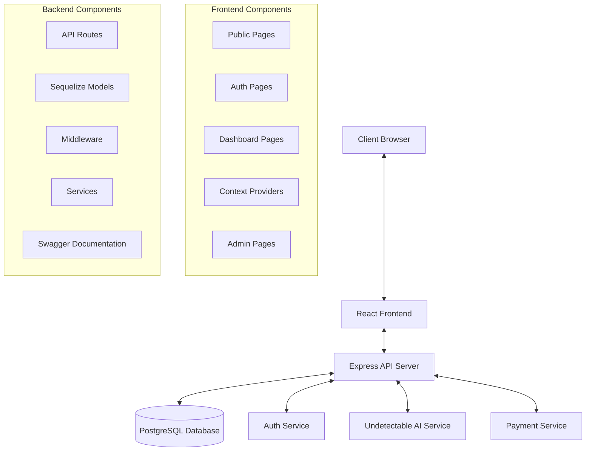

## Component Architecture

### Frontend Architecture

The frontend is built using React with TypeScript. It uses the following key libraries and patterns:

- **React Router** for navigation and route management
- **Context API** for state management
- **Fetch API** for communication with the backend
- **Tailwind CSS** for styling
- **React Hooks** for component logic

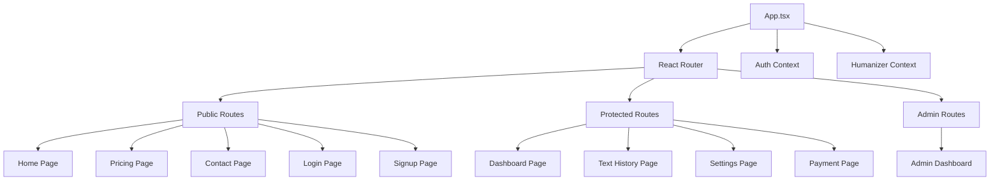

### Context Architecture

The application uses React Context API for state management across components.

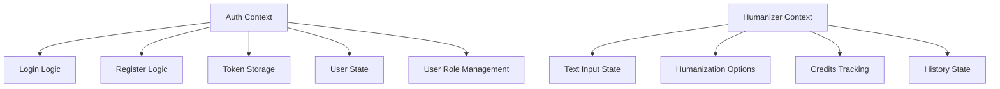

### Backend Architecture

The backend is built using Express.js with TypeScript. It follows a modular architecture with clear separation of concerns.

```mermaid
graph TD
    API[Express App] --> Middleware[Middleware]
    API --> Routes[Routes]
    API --> Swagger[Swagger Documentation]
    
    Middleware --> CORS[CORS]
    Middleware --> Helmet[Helmet]
    Middleware --> BodyParser[Body Parser]
    Middleware --> AuthMiddleware[Auth Middleware]
    Middleware --> AdminMiddleware[Admin Middleware]
    
    Routes --> AuthRoutes[Auth Routes]
    Routes --> TextRoutes[Text Routes]
    Routes --> UserRoutes[User Routes]
    Routes --> SubscriptionRoutes[Subscription Routes]
    Routes --> AdminRoutes[Admin Routes]
    
    AuthRoutes --> Login[Login]
    AuthRoutes --> Register[Register]
    
    TextRoutes --> Humanize[Humanize]
    TextRoutes --> History[Get History]
    
    UserRoutes --> Profile[Get Profile]
    UserRoutes --> UpdateProfile[Update Profile]
    UserRoutes --> Credits[Get Credits]
    
    SubscriptionRoutes --> Plans[Get Plans]
    SubscriptionRoutes --> Subscribe[Subscribe]
    SubscriptionRoutes --> UpdatePlan[Update Plan]
    
    AdminRoutes --> GetUsers[Get All Users]
    AdminRoutes --> GetUser[Get User Details]
    AdminRoutes --> GetStats[Get Platform Stats]
    AdminRoutes --> MakeAdmin[Make User Admin]
```

### Database Architecture

The application uses PostgreSQL with Sequelize ORM for data storage and management.

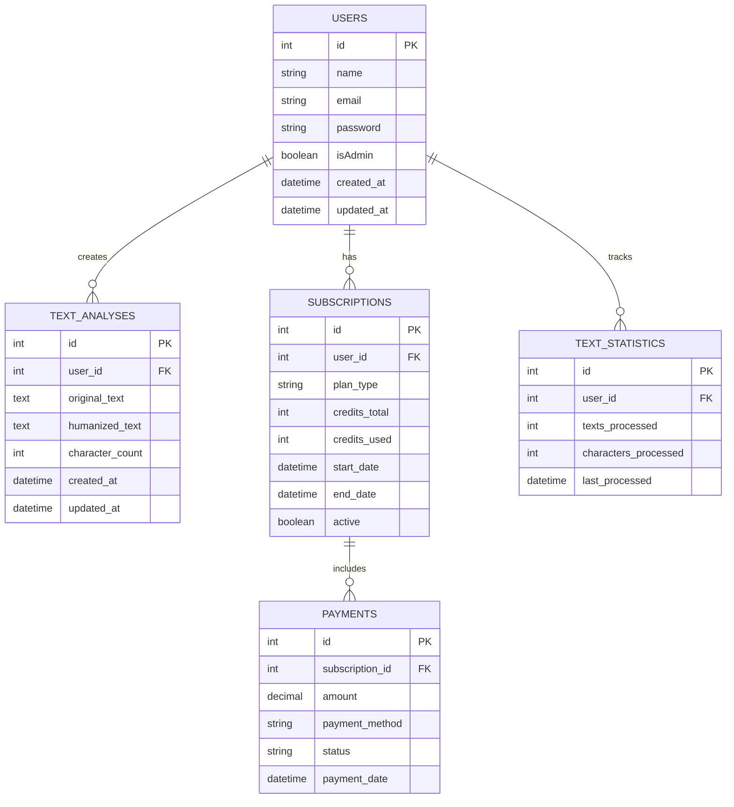

## Authentication and Authorization Flow

The application uses JWT (JSON Web Tokens) for authentication and role-based access control for authorization.

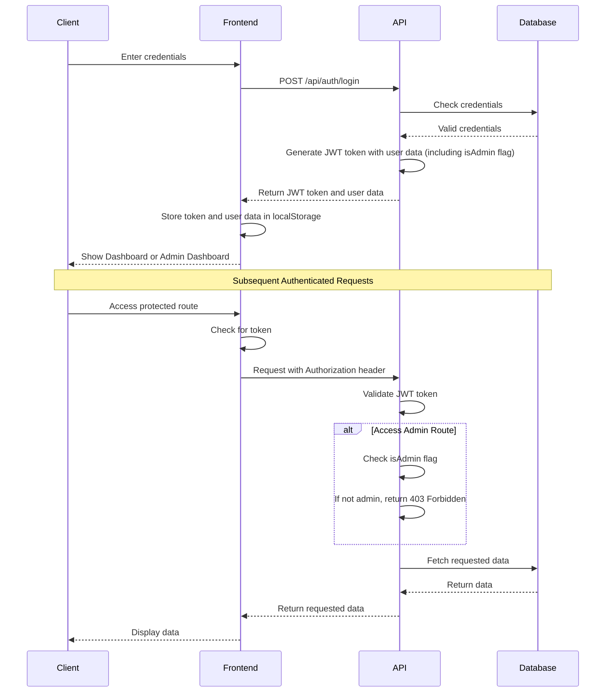

## API Documentation

The application includes comprehensive API documentation using Swagger UI.

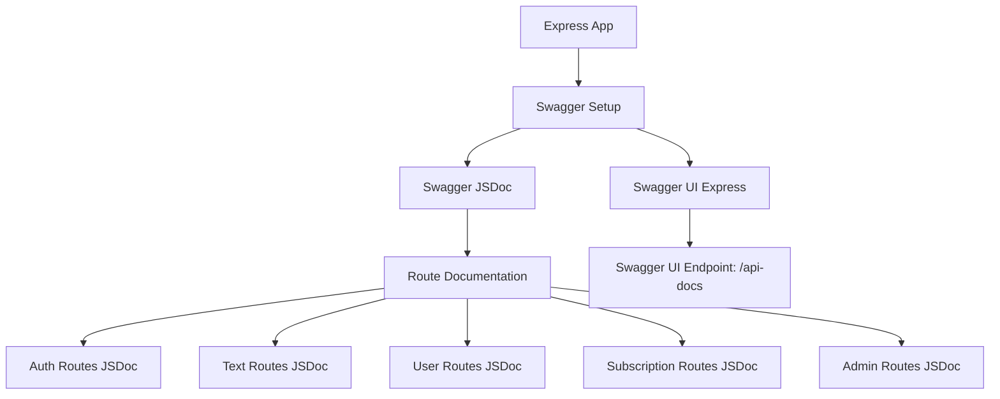

## Text Humanization Flow

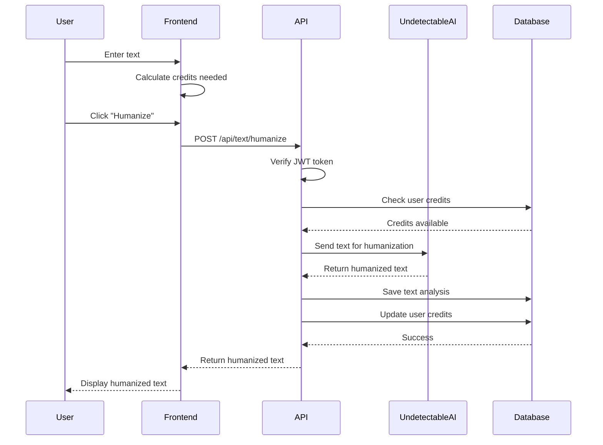

## Payment Processing Flow

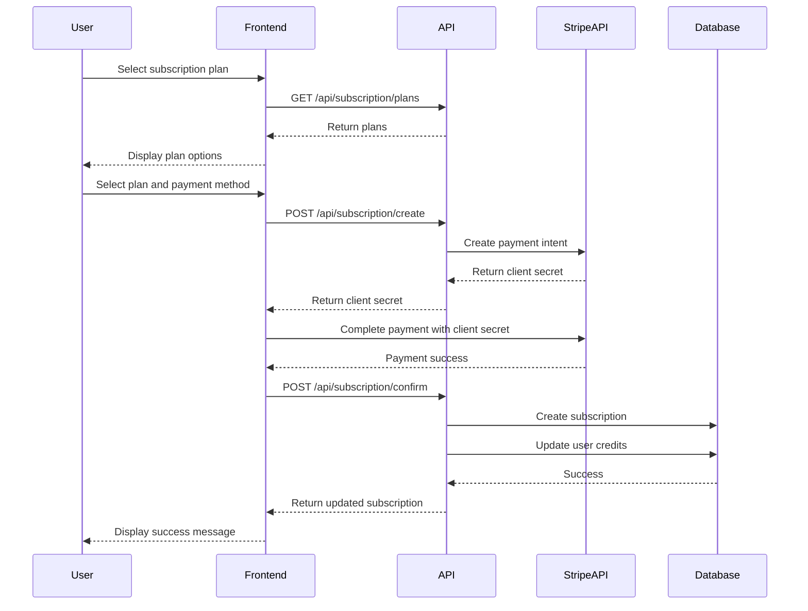

## Error Handling Strategy

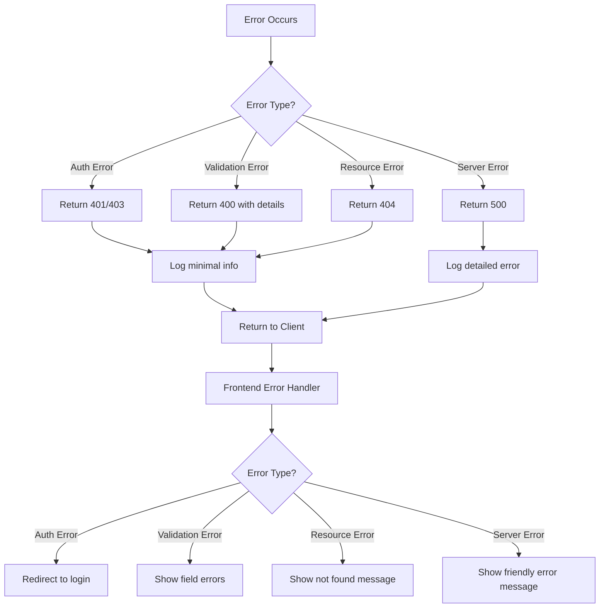

## Deployment Architecture

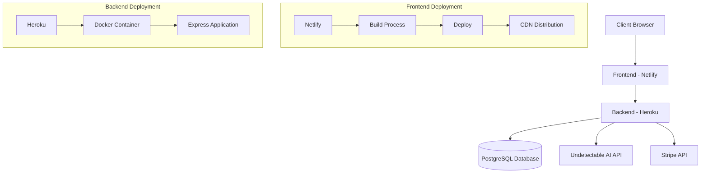

## Troubleshooting

### Common Issues

#### TypeScript Interface Conflicts

If you encounter TypeScript errors related to interface conflicts between middleware files, ensure each interface is declared only once. For example, the Express.Request interface should only be extended in one file, such as:

```typescript
// In auth.middleware.ts
declare global {
  namespace Express {
    interface Request {
      user?: {
        id: number;
        email: string;
      };
    }
  }
}
```

Other middleware files should then use this interface without redefining it.

#### Port Conflicts

The application uses the following ports by default:
- Frontend: 3000
- Backend: 3001

If you encounter port conflicts, you can change the port in:
- Frontend: Edit `package.json` and add `"PORT=3002"` to the start script
- Backend: Update the PORT variable in the .env file

#### Database Connection Issues

If the server fails to connect to the database, ensure:
1. PostgreSQL is running
2. The database credentials in .env are correct
3. The database exists (run `createdb ai_humanizer` if needed)
4. The database user has appropriate permissions
</rewritten_file>