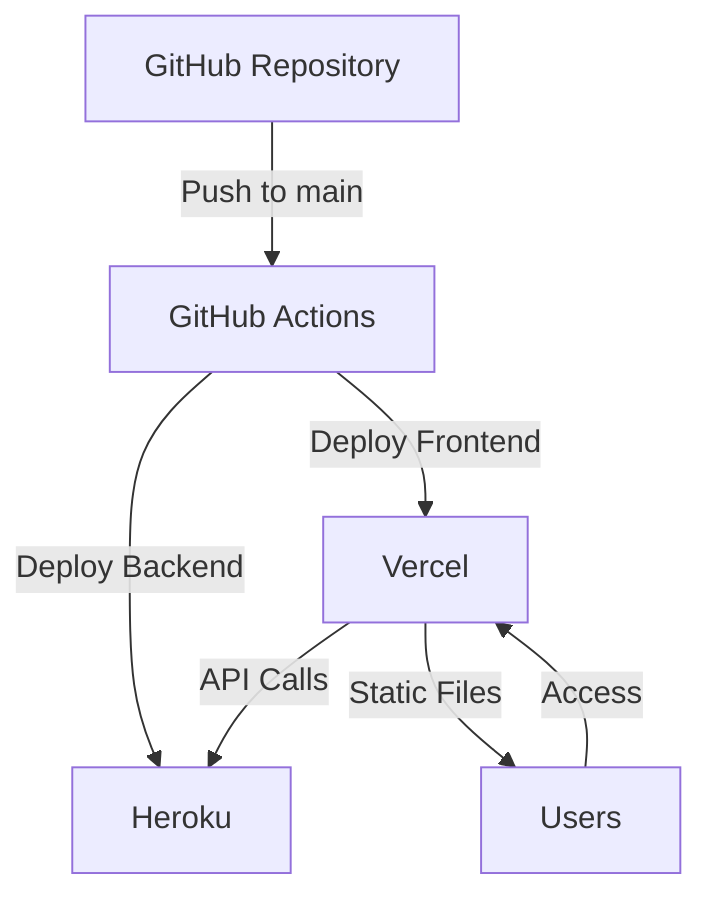

# Deployment Guide: Heroku + Vercel

## Architecture Overview



## Prerequisites

1. GitHub Account
2. Heroku Account
3. Vercel Account
4. PostgreSQL Database (for Heroku)

## Step 1: Heroku Setup

### 1.1 Create Heroku App
1. Go to [Heroku Dashboard](https://dashboard.heroku.com)
2. Click "New" → "Create new app"
3. Choose a unique app name (e.g., `ai-humanizer-backend`)
4. **Select the region closest to your users (United States or Europe) for optimal performance.**
5. Click "Create app"

### 1.2 Get Heroku API Key
1. Go to [Heroku Account Settings](https://dashboard.heroku.com/account)
2. Scroll to "API Key" section
3. Click "Reveal" to see your API key
4. Copy the API key

### 1.3 Add Heroku PostgreSQL
1. In your Heroku app dashboard
2. Go to "Resources" tab
3. Search for "Heroku Postgres"
4. Click "Provision"

### 1.4 Configure Heroku Environment Variables
1. Go to "Settings" tab
2. Click "Reveal Config Vars"
3. Add the following variables:
   ```
   NODE_ENV=production
   JWT_SECRET=your_jwt_secret
   OPENAI_API_KEY=your_openai_key
   ```

## Step 2: Vercel Setup

### 2.1 Create Vercel Project
1. Go to [Vercel Dashboard](https://vercel.com/dashboard)
2. Click "Add New" → "Project"
3. Import your GitHub repository
4. Configure project:
   - Framework Preset: Vite
   - Root Directory: `frontend`
   - Build Command: `npm run build`
   - Output Directory: `dist`

### 2.2 Get Vercel Credentials
1. **Vercel Token**:
   - Go to [Vercel Account Settings](https://vercel.com/account/tokens)
   - Click "Create Token"
   - Name it (e.g., "GitHub Actions")
   - Copy the token

2. **Organization ID**:
   - Go to [Vercel Dashboard](https://vercel.com/dashboard)
   - Click on your organization
   - The ID is in the URL: `https://vercel.com/orgs/[org-id]`

3. **Project ID**:
   - Go to your project settings
   - The ID is in the URL: `https://vercel.com/[org-id]/[project-id]`

### 2.3 Configure Vercel Environment Variables
1. Go to project settings
2. Click "Environment Variables"
3. Add:
   ```
   VITE_API_URL=https://your-heroku-app.herokuapp.com
   ```

## Step 3: GitHub Secrets Setup

### 3.1 Add Heroku Secrets
1. Go to your GitHub repository
2. Click "Settings" → "Secrets and variables" → "Actions"
3. Add the following secrets:
   ```
   HEROKU_API_KEY=your_heroku_api_key
   HEROKU_APP_NAME=your_heroku_app_name
   HEROKU_EMAIL=your_heroku_email
   ```

### 3.2 Add Vercel Secrets
1. In the same GitHub Secrets page
2. Add the following secrets:
   ```
   VERCEL_TOKEN=your_vercel_token
   VERCEL_ORG_ID=your_org_id
   VERCEL_PROJECT_ID=your_project_id
   ```

## Step 4: Deployment Process

### 4.1 Initial Deployment
1. Push your code to the main branch:
   ```bash
   git add .
   git commit -m "Initial deployment setup"
   git push origin main
   ```

2. GitHub Actions will automatically:
   - Run tests
   - Deploy backend to Heroku
   - Deploy frontend to Vercel

### 4.2 Verify Deployment
1. Check Heroku deployment:
   - Visit `https://your-app-name.herokuapp.com/health`
   - Should return `{"status":"ok"}`

2. Check Vercel deployment:
   - Visit your Vercel project URL
   - Should show your frontend application
   - Test the connection to the backend

## Step 5: Monitoring and Maintenance

### 5.1 Heroku Monitoring
1. Go to Heroku dashboard
2. Check:
   - Application logs
   - Database metrics
   - Dyno status

### 5.2 Vercel Monitoring
1. Go to Vercel dashboard
2. Check:
   - Deployment status
   - Build logs
   - Analytics

## Troubleshooting

### Common Issues

1. **Backend Deployment Fails**
   - Check Heroku logs: `heroku logs --tail`
   - Verify environment variables
   - Check database connection

2. **Frontend Deployment Fails**
   - Check Vercel deployment logs
   - Verify environment variables
   - Check build output

3. **Database Connection Issues**
   - Verify Heroku PostgreSQL add-on
   - Check database credentials
   - Test connection locally

### Support Resources

- [Heroku Documentation](https://devcenter.heroku.com)
- [Vercel Documentation](https://vercel.com/docs)
- [GitHub Actions Documentation](https://docs.github.com/en/actions) 