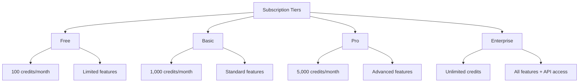
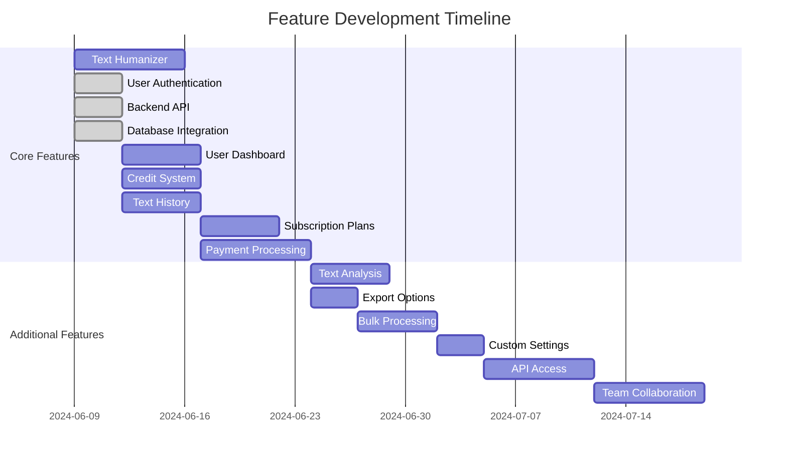
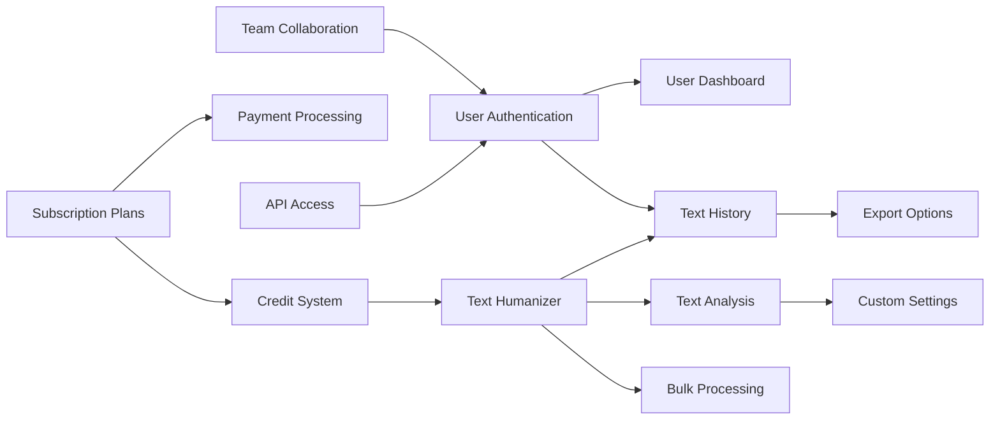

# Project Features

This document lists all features of the AI Text Humanizer website.

## Feature List

### Core Features
- [Text Humanizer] - AI-powered text rewriting and humanization using Undetectable AI
- [User Authentication] - Secure login and registration system with JWT (Implemented)
- [Subscription Plans] - Multiple pricing tiers with different features (Implemented)
- [Credit System] - Usage tracking and credit management (Implemented)
- [Text History] - Save and manage past humanized texts (Implemented)
- [Payment Processing] - Secure payment handling with Stripe (Implemented)
- [Backend API] - Express.js server for API endpoints (Implemented)
- [Database Integration] - PostgreSQL schema with Sequelize ORM (Implemented)
- [Admin Dashboard] - Platform management for administrators (Implemented)

### Additional Features
- [Text Analysis] - AI-powered content analysis and suggestions
- [Export Options] - Multiple format export (PDF, DOCX, TXT)
- [Bulk Processing] - Process multiple texts at once
- [API Access] - Developer API for enterprise users
- [Custom Settings] - Adjustable humanization parameters
- [Team Collaboration] - Share and collaborate on texts
- [User Dashboard] - View and manage text history and account (Implemented)
- [Responsive Design] - Mobile-friendly interface (Implemented)
- [API Documentation] - Swagger integration for API reference (Implemented)

## Feature Status
| Feature | Status | Priority | Last Updated |
|---------|--------|----------|--------------|
| Text Humanizer | Implemented | High | 2024-06-15 |
| User Authentication | Implemented | High | 2024-06-15 |
| Subscription Plans | Implemented | High | 2024-06-15 |
| Credit System | Implemented | High | 2024-06-15 |
| Text History | Implemented | Medium | 2024-06-15 |
| Payment Processing | Implemented | High | 2024-06-15 |
| Backend API | Implemented | High | 2024-06-15 |
| Database Integration | Implemented | High | 2024-06-15 |
| Text Analysis | Planned | Medium | 2024-06-15 |
| Export Options | Planned | Low | 2024-06-15 |
| Bulk Processing | Planned | Medium | 2024-06-15 |
| API Access | Planned | Low | 2024-06-15 |
| Custom Settings | Planned | Medium | 2024-06-15 |
| Team Collaboration | Planned | Low | 2024-06-15 |
| User Dashboard | Implemented | High | 2024-06-15 |
| Responsive Design | Implemented | High | 2024-06-15 |
| Admin Dashboard | Implemented | High | 2024-06-15 |
| API Documentation | Implemented | Medium | 2024-06-15 |

## Subscription Tiers


## Credit System
Each subscription tier comes with a specific number of credits. Credits are consumed based on the length of the text being humanized.

| Text Length | Credits Used |
|-------------|--------------|
| 0-500 chars | 1 credit     |
| 501-1000 chars | 2 credits |
| 1001-2000 chars | 4 credits |
| 2001-5000 chars | 10 credits |
| 5001+ chars | 20 credits |

## Feature Details

### Text Humanizer
- Input field for text entry
- Options for humanization level (slight, moderate, substantial)
- Real-time character count
- Credit usage estimation
- Copy to clipboard functionality
- Save to history option

### User Dashboard
- Overview of account status
- Credit usage statistics
- Text history with filtering options
- Account settings management
- Subscription plan information and upgrade options

### Payment Processing
- Secure credit card processing
- Subscription management
- Invoice history
- Payment method management
- Multiple payment options (Credit Card, PayPal)
- Tiered subscription plans with different pricing

### Admin Dashboard
- Platform-wide statistics and metrics
- User management with role assignment
- Ability to grant admin privileges
- User filtering and pagination
- Subscription analytics by plan type
- Statistics on text processing volume
- New user and text analysis trends

## Feature Roadmap


## Feature Dependencies


## Undetectable AI Integration
The Text Humanizer feature integrates with the Undetectable AI API to provide high-quality AI text humanization. The integration works as follows:

1. User inputs text in the humanizer interface
2. Frontend sends the text to our backend API
3. Backend makes a request to Undetectable AI with the appropriate parameters
4. Undetectable AI processes the text and returns humanized version
5. Backend saves both original and humanized versions to the database
6. Backend updates the user's credit balance
7. Frontend displays the humanized text to the user

### API Implementation
```javascript
// Example of Undetectable AI API integration
async function humanizeText(text, level = 'moderate') {
  const response = await fetch('https://api.undetectable.ai/humanize', {
    method: 'POST',
    headers: {
      'Content-Type': 'application/json',
      'Authorization': `Bearer ${process.env.UNDETECTABLE_API_KEY}`
    },
    body: JSON.stringify({
      text,
      humanization_level: level
    })
  });
  
  return await response.json();
}
</rewritten_file> 