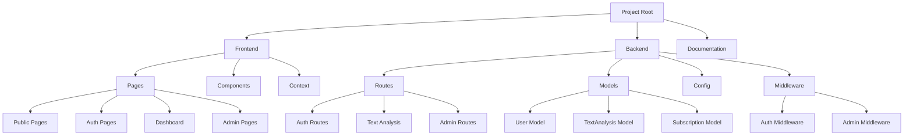
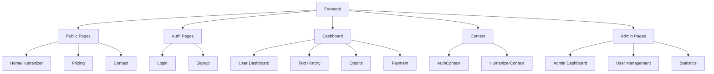
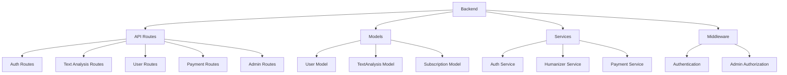
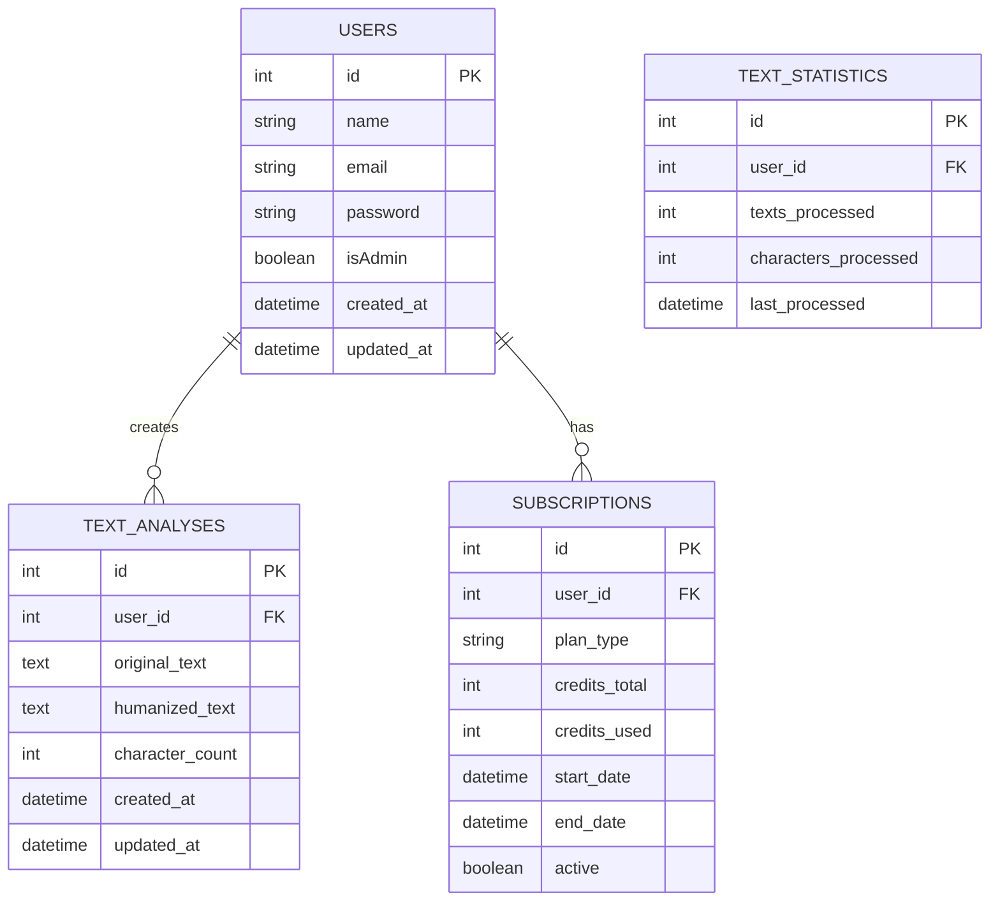
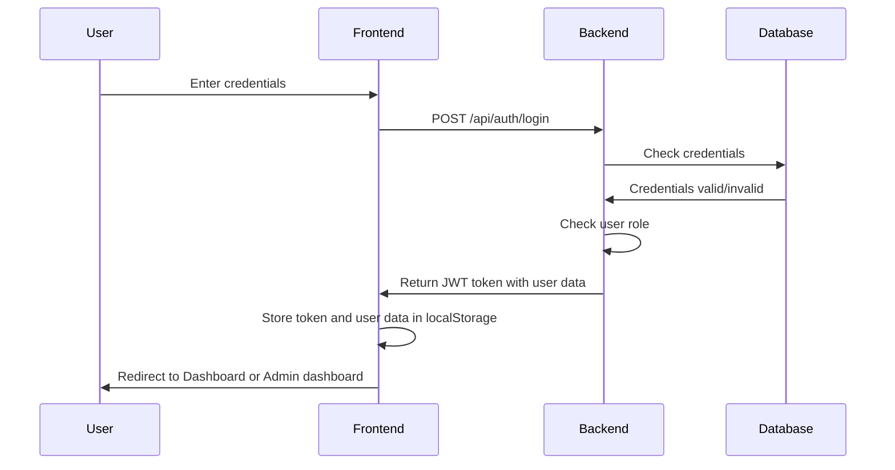
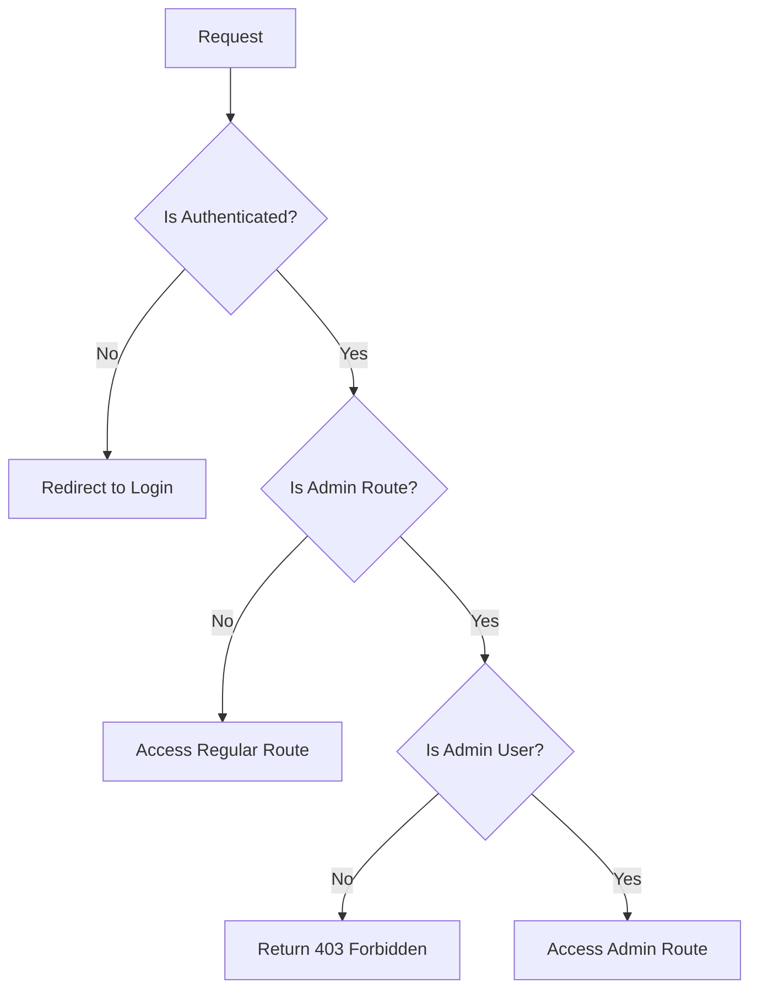
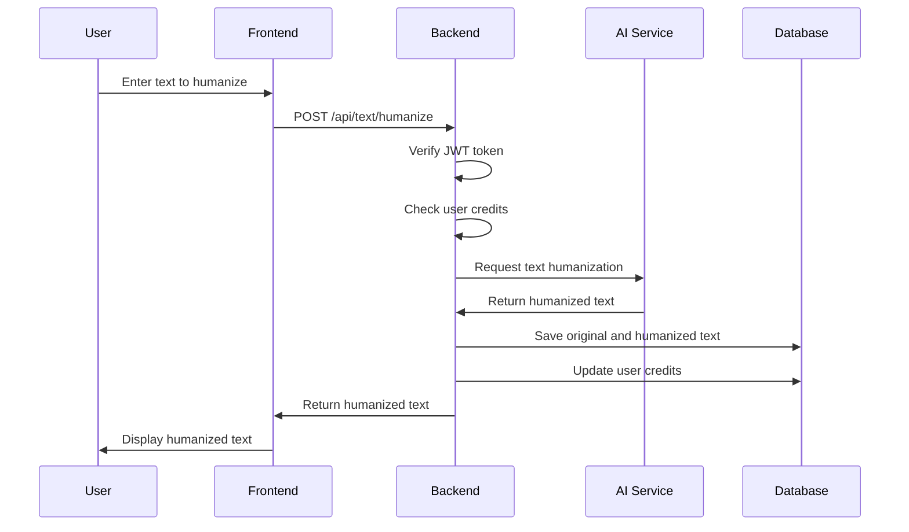

# AI Text Humanizer Website

## Overview
This project is an AI-powered text humanizer website that helps users rewrite and humanize AI-generated content to make it appear more human-like. The platform offers various subscription tiers with different features and credit limits. The project is implemented as a full-stack web application with a React frontend, Express backend, and PostgreSQL database.

## Project Structure


## Core Features
See [features.md](./features.md) for a detailed list of project features.

## Architecture
The project follows a modern web application architecture with clear separation of concerns.

### Frontend Architecture


### Backend Architecture


### Database Schema


### Authentication Flow


### Role-Based Access Control


### Text Humanization Flow


## Development Guidelines
1. Follow React best practices for frontend development
2. Implement secure authentication with JWT
3. Ensure responsive design for all pages
4. Maintain comprehensive documentation
5. Write unit tests for critical functionality
6. Use TypeScript for type safety
7. Follow RESTful API design principles
8. Use environment variables for configuration
9. Use PostgreSQL for persistent data storage

## Technology Stack
- **Frontend**: React, TypeScript, Tailwind CSS
- **Backend**: Node.js, Express, TypeScript
- **Database**: PostgreSQL with Sequelize ORM
- **Authentication**: JWT, Context API (frontend)
- **Payment**: Stripe (planned)
- **AI Processing**: Undetectable AI API
- **Deployment**: Netlify (frontend), Heroku (backend)
- **API Documentation**: Swagger UI, JSDoc

## Getting Started
1. Clone the repository
2. Install dependencies (frontend and backend)
3. Set up environment variables in a `.env` file (see example below)
4. Create the PostgreSQL database using `database.sql`
5. Start the backend server: `npm run server` (or `npx ts-node src/server/index.ts`)
6. Start the frontend: `npm start`
7. Access the application at `localhost:3000` (frontend) and `localhost:3001` (backend API)

### Example .env file
```
DB_HOST=localhost
DB_PORT=5432
DB_NAME=ai_humanizer
DB_USER=postgres
DB_PASSWORD=Testers
PORT=3001
JWT_SECRET=your-super-secret-jwt-key
UNDETECTABLE_API_KEY=your-undetectable-ai-api-key
```

## API Endpoints

### Authentication
- `POST /api/auth/signup` - Register a new user
- `POST /api/auth/login` - Log in a user

### Text Analysis
- `POST /api/text/humanize` - Humanize text and save to history
- `GET /api/text/history` - Get user's text history
- `GET /api/text/:id` - Get specific text analysis

### User Management
- `GET /api/users/me` - Get current user profile
- `PUT /api/users/me` - Update user profile
- `GET /api/users/credits` - Get user credit information

### Subscription Management
- `GET /api/subscriptions` - Get available subscription plans
- `POST /api/subscriptions` - Create a new subscription
- `PUT /api/subscriptions/:id` - Update subscription

### Admin Management
- `GET /api/admin/users` - Get all users (admin only)
- `GET /api/admin/user/:id` - Get specific user details (admin only)
- `GET /api/admin/stats` - Get platform statistics (admin only)
- `POST /api/admin/make-admin/:id` - Grant admin privileges to user (admin only)

## API Documentation
API documentation is available via Swagger UI at `http://localhost:3001/api-docs`

## Contributing
Please read our contributing guidelines before submitting pull requests.

## License
MIT License - See LICENSE file for details 